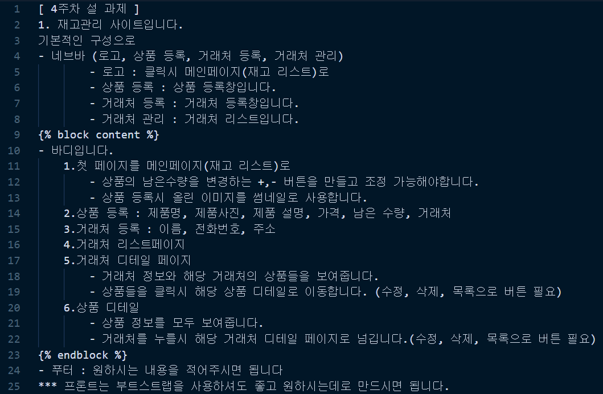

<h1> 재고관리 사이트</h1>

<h4> 1) user requirements</h4>

 

<h4> 2) path list</h4>
/ [name='item_list'] 
detail/<int:pk> : [name='item_detail'] 
create/ [name='item_create'] 
update/<int:pk> [name='item_update'] 
delete/<int:pk> [name='item_delete'] 
plus/<int:pk> [name='item_plus'] 
minus/<int:pk> [name='item_minus']  

company/ [name='company_list'] 
company/detail/<int:pk> [name='company_detail'] 
company/create/ [name='company_create'] 
company/update/<int:pk> [name='company_update'] 
company/delete/<int:pk> [name='company_delete'] 